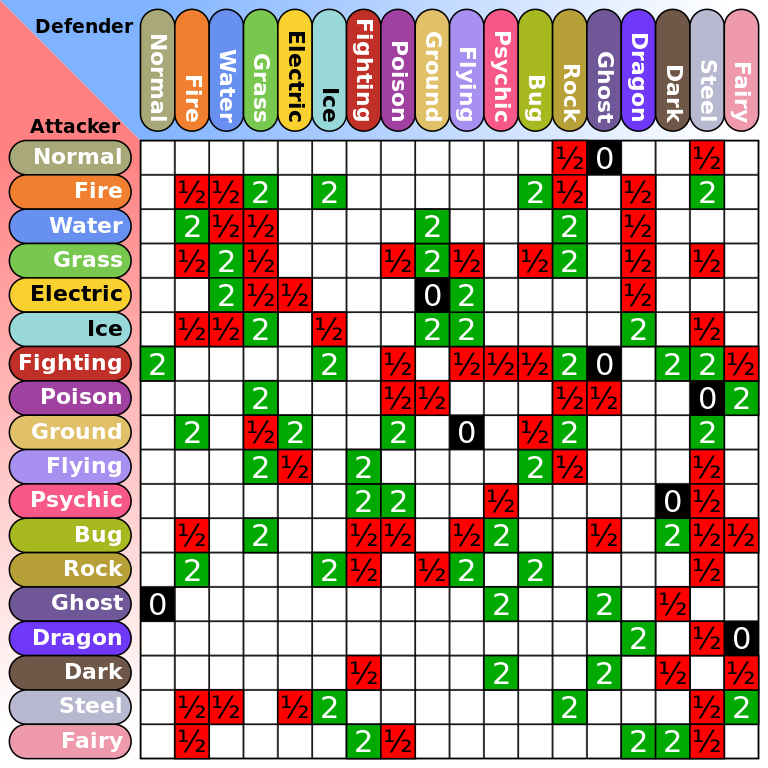

# Pokemon® types chart game

<p align="center">
  
</p>
<p align="center">Created by StroyII</p>
<p align="center">Collaborators : @Yougo-rgb, @Emmaiy</p>


## 📖 Overview
<ul> 
    <li> The <strong>PTCG</strong> is a little game about the Pokemon® franchise a friend of mine suggested to make in <strong>python</strong> so here i am. 
    <li> The goal is simillar to a <strong>"Rock-Paper-Siscors"</strong>, each player chose a type inside from the type chart and the one who hit super effective on the other win !
    <li> The game can be played alone or against a friend (no online only local)
    <li>It's a fun game to lose time and to know the type chart better
</ul>


## 📜 Rules 

- Each Player chose turn after turn a type and the one who hit super effective on the other gain +1 point
- There is still no mecanics with the resistances only the weaknesses
- If both types hit supper effective on the other like "Dragon vs Dragon" both player win 
- The first player to win a certain amount of point win the game !
- If you have trouble to remember the chart here it is : 


<br>
<div style="text-align:center;">
  
</div>


## 🖥️ Installation
### Python 3.12 is recommended

1. **Clone the GitHub Repository to one of your folder :**
```bash
git clone git@github.com:StroyII/Pokemon-types-game.git
```

2. **Open VScode in the exact folder**

3. **Execute main.py**

4. **Enjoy !!!**

# 

<div style="text-align:center;">
  
</div>